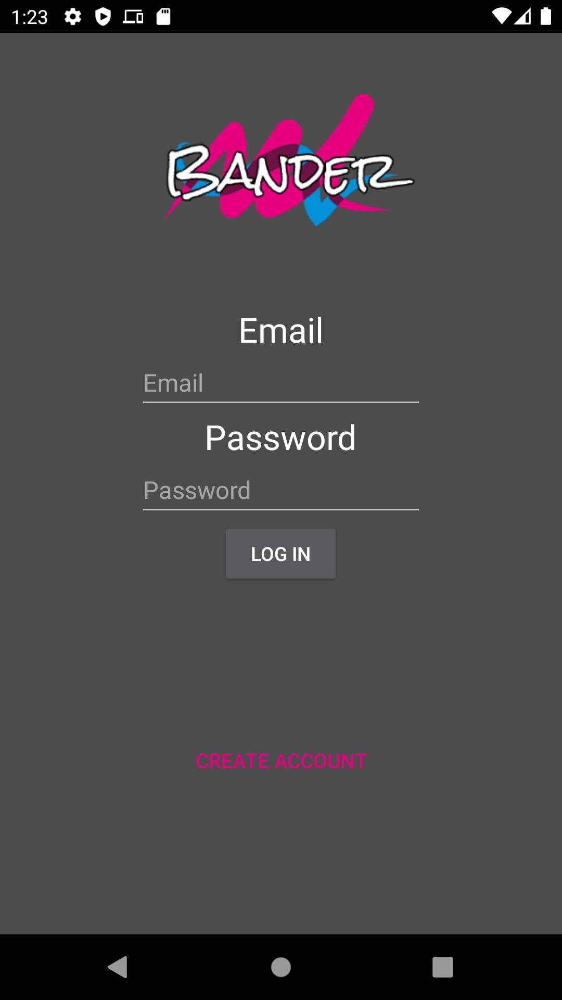
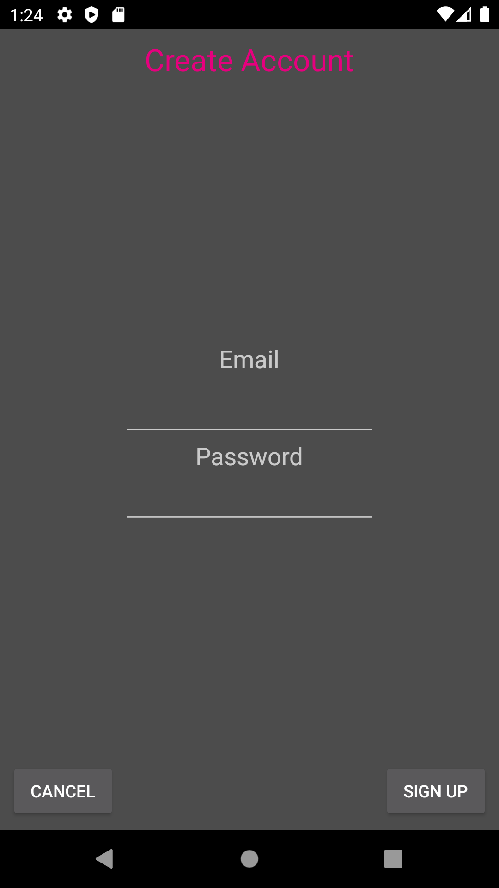
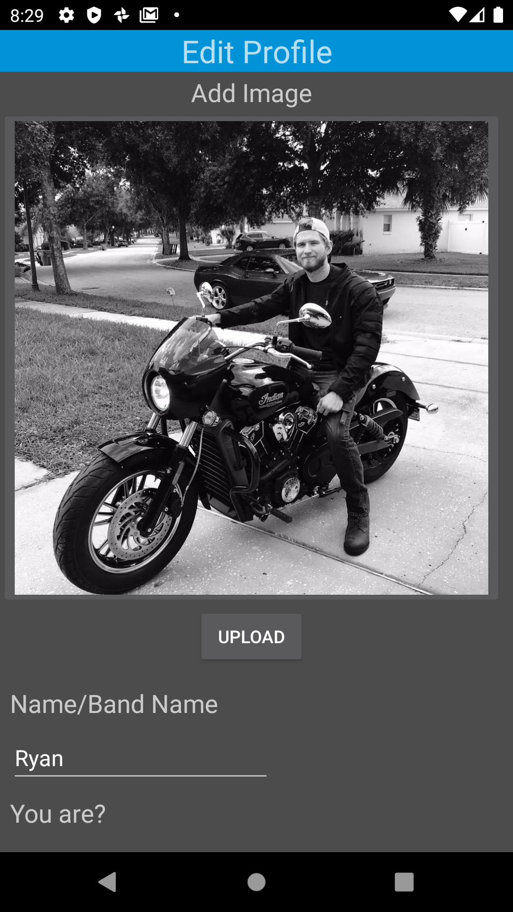
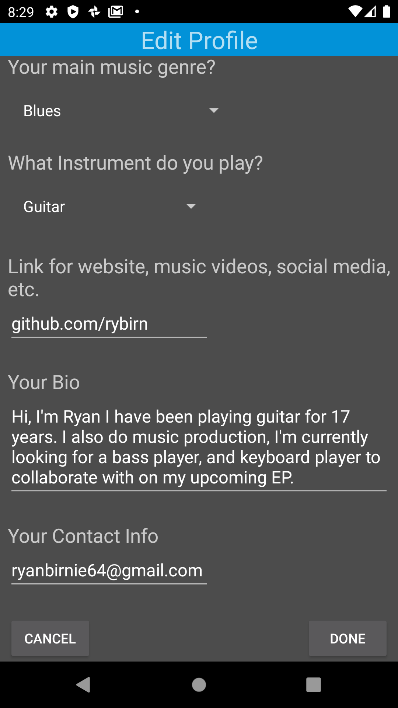
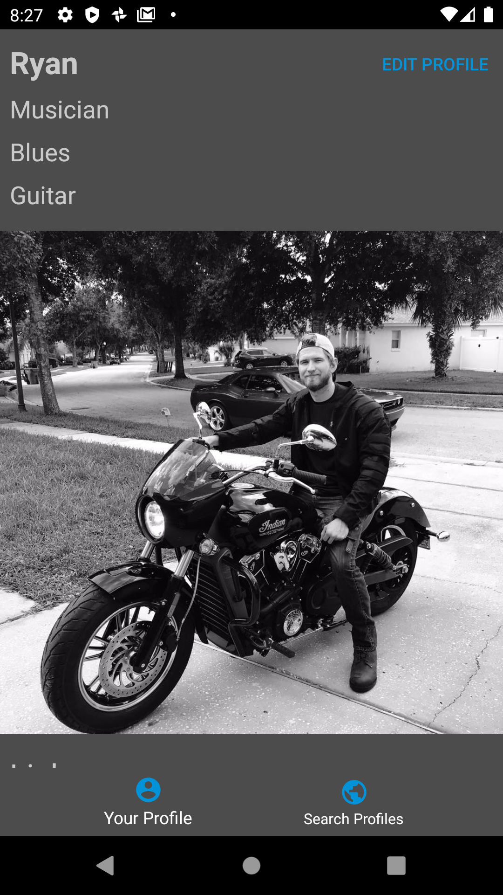
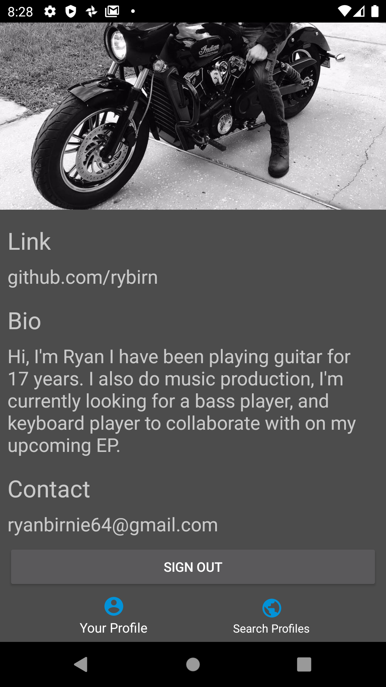
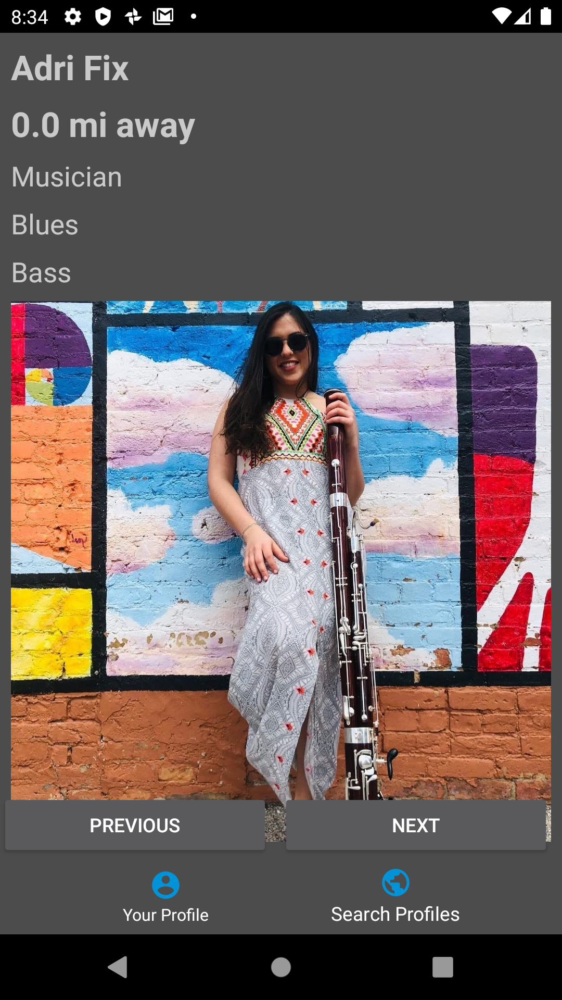
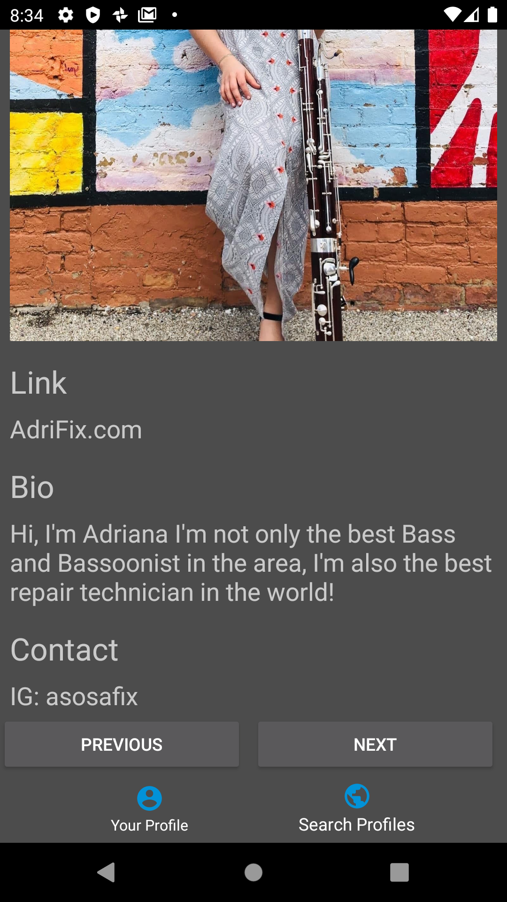

# Bander

  

 Bander is a social networking app for musicians, producers, and live venues. This app helps artists find collaborators, and live music venues find great local talent.

-- Currently being redesigned with a better UI, and switching database over to AWS Amplify. --

### Login Screen 
When first opening the app users will be presented the login screen, from here they can input their email, and password and login. Or they can click the "Create Account" button to create a new account.  

  

### Create New Account 
After pressing the "Create Account Button" users will be asked to enter a email, and password. After clicking the "Sign Up" button, the email will be verified in the database and if no current identical email is found, a new user will be added to the database.  

  

### Edit Profile Screen 
Upon Creating a new account users will enter the Edit Profile Screen, from here the user can upload a image, input their main genre of music, main instrument, bio, link to social media or website, and contact info.  

  

  

### Your Profile Screen 
After Selecting "Done" on the previous Edit Profile Screen users will be taken to their profile so they can see what other users will see when their profile shows up. From here you can edit your profile, sign out which takes the user back to the Login Screen, and navigate to the Searching Profiles Screen.  

  

### Searching Profiles Screen 
From the Searching Profiles Screen users can view other users information, distance away, and contact info. Selecting the "Previous" and "Next" buttons will move to either the next or previous user in the database and repopulate the Searching Profiles Screen with the new users information.

  

## Whats Next? 
<ul>
<li>Develop filtering options so users can find others based on genre, instrument, etc.</li>
<li>Embed Soundcloud into the app allowing users to show off their top 3 songs</li>
<li>Allow users to add a 30 second video to show off their skills</li>
<li>Change location usage to allow users to select a location rather than use their location data from their phone</li>
<li>Create a "Like or Pass" system where users can like other users and if they match then allow users to communicate with each other </li>
<li>Develop a Matches screen with a messenger service inside the app allowing users who match with each other to communicate from inside the app. Removing the need for outside contact info. </li>
<li>Update UI</li>
</ul>